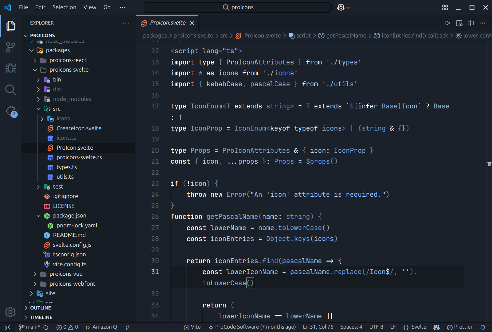
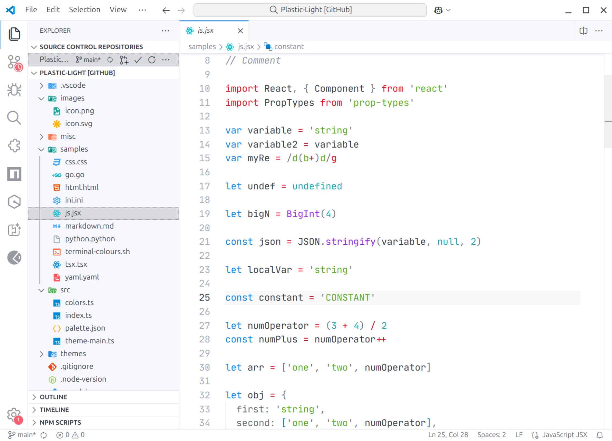

# ProCode VSCode Themes

A collection of Visual Studio Code themes I created

## Themes

- [**🗻 Frost**](./frost-theme/) - An arctic, light-bluish, low-contrast VSCode theme
- [**♻️ Plastic Light**](./plastic-light-theme/) - Light version of Will Stone's [Plastic](https://marketplace.visualstudio.com/items?itemName=will-stone.plastic) theme
- [**🎨 ProCode Theme**](./procode-theme/) - A color theme inspired by Plastic and product icon theme using [ProIcons](https://github.com/ProCode-Software/proicons) (in development)

## Screenshots
Frost:

Plastic Light:

## License
All extensions are licensed under the [MIT License](./LICENSE).